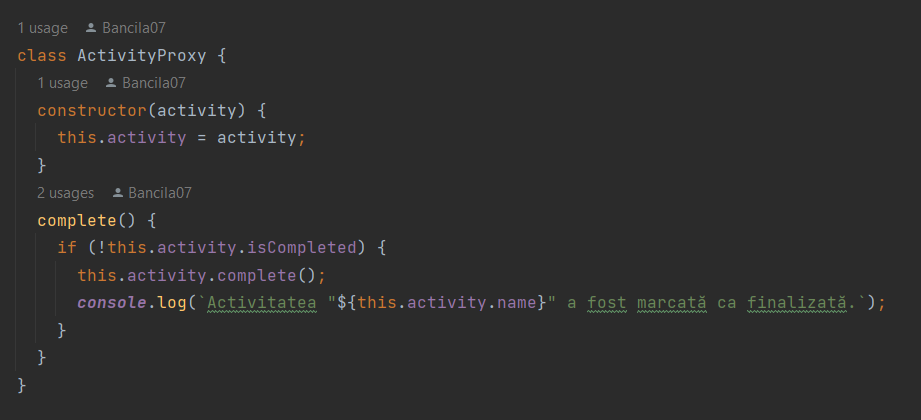
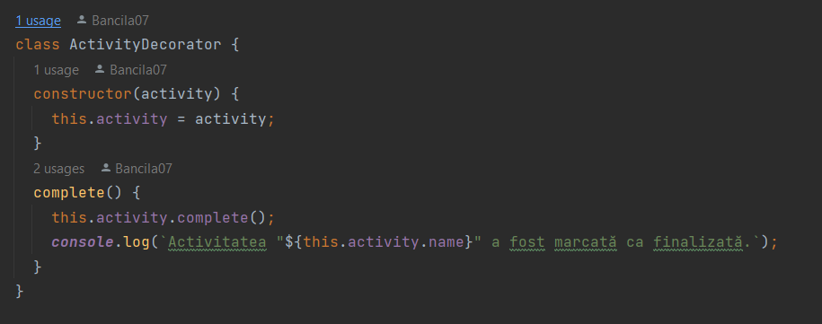
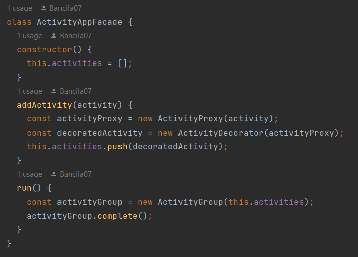
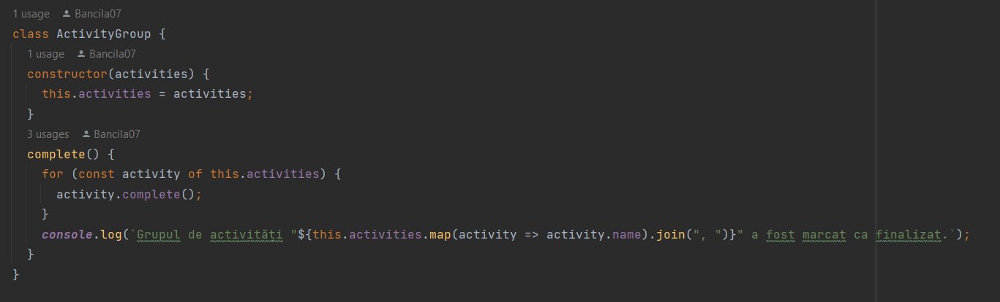

În acest proiect, am folosit patru Structural Design Patterns: Proxy, Decorator, Facade și Composite. Am creat o clasă Activity care reprezintă o activitate simplă. Am creat apoi o clasă ActivityProxy care încapsulează o activitate și permite marcarea ca finalizată doar o singură dată. Am creat, de asemenea, o clasă ActivityDecorator care încapsulează o activitate și permite marcarea ca finalizată de mai multe ori. Am creat, de asemenea, o clasă ActivityGroup care reprezintă un grup de activități și permite marcarea lor ca finalizate într-un singur pas. În cele din urmă, am creat o clasă ActivityAppFacade care combină toate aceste elemente și oferă o interfață simplă pentru adăugarea și rularea activităților.
>Proxy: În clasa ActivityProxy am folosit acest pattern pentru a oferi un nivel de acces intermediar la o activitate. Astfel, utilizatorii pot accesa activitatea prin intermediul unui proxy, care verifică dacă activitatea a fost deja marcată ca finalizată și permite marcarea ei doar o singură dată.
>
> 
> Decorator: În clasa ActivityDecorator am folosit acest pattern pentru a adăuga funcționalitate suplimentară la o activitate. În cazul nostru, decoratorul permite marcarea activității de mai multe ori.
> 
> 
> Facade: În clasa ActivityAppFacade am folosit acest pattern pentru a oferi o interfață simplă și unificată pentru utilizatorii aplicației noastre. Astfel, utilizatorii pot adăuga și rula activități fără a fi nevoie să se ocupe de detalii tehnice sau de complexitatea codului.
> 
> 
> Composite: În clasa ActivityGroup am folosit acest pattern pentru a permite gruparea mai multor activități sub forma unei singure entități. Astfel, utilizatorii pot rula mai multe activități într-un singur pas.
> 
> 
În interfața de utilizator, am creat un formular pentru adăugarea unei activități noi și un buton pentru rularea activităților. Când utilizatorul adaugă o activitate, aceasta este adăugată la aplicație și afișată într-o listă. Când utilizatorul apasă butonul "Rulează activitățile", aplicația rulează toate activitățile adăugate anterior și le marchează ca finalizate.